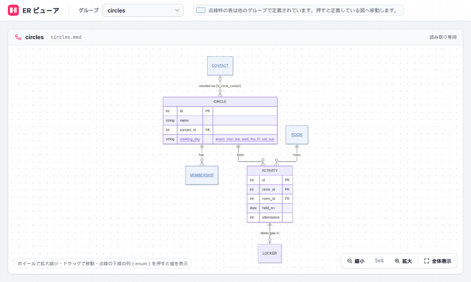
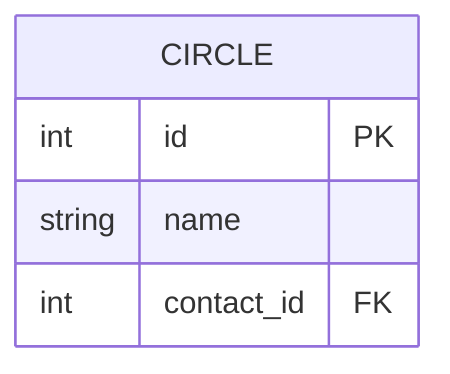
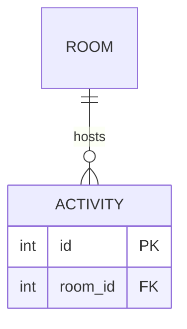
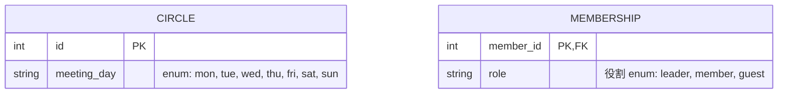

<div align="center">

# ER ビューア

**分割した Mermaid ER 図を、分割したまま横断して読む。**

図の中の「他のグループの表」を押すと、その表を定義している図へ移動できる、読むだけのビューアです。

[](https://mermaid.js.org/syntax/entityRelationshipDiagram.html)
[](https://www.typescriptlang.org/)
[](https://vite.dev/)
[](https://vitest.dev/)



<sub>同梱の例（架空の公民館サークル）で、グループ間の移動 → 候補の選択 → 拡大縮小 → enum の値の表示 を操作しています</sub>

</div>

## 特長

- **グループ間リンク** — 関係線にだけ出てくる表を押すと、その表を定義しているグループの図へ移動し、対象の表を中央に強調表示
- **候補の選択** — 同じ表を複数のグループが定義していれば候補から選ぶ。どこにも定義が無ければリンクにしない
- **識別名で照合** — `ROOM["部屋"]` のような表示名ではなく、図に書かれた識別名 `ROOM` の完全一致で突き合わせる
- **enum の値** — 属性コメントに `enum: mon, tue, …` と書いた列を押すと、値の一覧を吹き出しで表示
- **拡大縮小・移動** — マウスホイール、「縮小」「拡大」「全体表示」ボタン、ドラッグ
- **読むだけ** — 図は書き換えない。読む図の置き場所（ディレクトリかマニフェスト）は `ER_DIAGRAMS` で指定
- **静的サイト** — `npm run build` で `dist/` に書き出して、任意の静的サーバーで配信できる

検索・絞り込み・書き出し・編集は範囲外です。

## クイックスタート

Node.js 22 以降が必要です。

```bash
git clone https://github.com/ikisuke/er-tools.git
cd er-tools
npm install
npm run dev                                   # http://127.0.0.1:47321 で同梱の例を表示
```

自分の図を読むときは、図を置いたディレクトリを渡します。

```bash
ER_DIAGRAMS=/path/to/diagrams npm run dev
```

図の書き方は「[ER 図の書き方](#er-図の書き方グループ間リンクを効かせるには)」を見てください。

## 動作の詳細

- 図の置き場所にあるグループから 1 つを選び、その ER 図を Mermaid でそのまま描画する（列・関係線のラベルは元の図のとおり）
- その図に属性ブロックが無く、関係線にだけ出てくる表をリンクにする
  - 同じ識別名を属性ブロック付きで定義しているグループが 1 つ → その図へ移動し、対象の表を中央に表示して強調表示する
  - 複数ある → 候補を示して選ばせる
  - 無い → リンクにしない
- 照合は図に書かれたノードの識別名で行います（`ROOM["部屋"]` の場合は `ROOM`）。表示名や部分一致では判断しません。大文字小文字も区別します
- 属性のコメントに `enum: 値1, 値2, …` と書いた列は、点線の下線付きで表示し、押すと値の一覧を吹き出しで表示する（書き方は「ER 図の書き方」の 7）
- 図は拡大縮小・移動できます（図の部分のみ）
  - マウスホイール: カーソル位置を中心に拡大縮小
  - 右下の「縮小」「拡大」「全体表示」ボタン（全体表示は図全体が収まる倍率。最大 100%）
  - ドラッグ: 図を移動（リンクの表の上から始めても移動になり、移動先へは飛びません）
  - グループを開いたときは全体表示、リンクで移動したときは対象の表を 100% 以上で中央に表示
- 表示中のグループと表は URL（`#g=<グループ>&e=<表>`）に入るので、ブラウザの戻る/進むが使えます

## 図の置き場所を指定する

環境変数 `ER_DIAGRAMS` に、**ディレクトリ** か **マニフェスト（JSON）** のパスを渡します。未指定なら `examples/diagrams` を読みます。

```bash
# ディレクトリ: 直下の .mmd / .mermaid / .md / .markdown を 1 ファイル = 1 グループとして読む
ER_DIAGRAMS=/path/to/diagrams npm run dev

# マニフェスト: グループ名と並び順を指定する
ER_DIAGRAMS=/path/to/manifest.json npm run dev

# 静的ファイルとして書き出す（dist/ を任意の静的サーバーで配信）
ER_DIAGRAMS=/path/to/diagrams npm run build
npm run preview      # http://127.0.0.1:47322 で確認
```

- ディレクトリ指定では、ファイル名（拡張子なし）がグループ名になります
- `.md` / `.markdown` では、`erDiagram` を含む最初の ```` ```mermaid ```` ブロックを図として読みます
- `erDiagram` が見つからないファイルや、グループ名の重複は読み飛ばし、画面上部に警告を出します

マニフェストの形式（`file` はマニフェストからの相対パス）:

```json
{
  "groups": [
    { "name": "サークル", "file": "diagrams/circles.mmd" },
    { "name": "会員", "file": "diagrams/members.mmd" }
  ]
}
```

## ER 図の書き方（グループ間リンクを効かせるには）

このビューアは、次の書き方で作られた図を前提にしています。ツールはこの書き方を強制せず、図の内容の正しさも判断しません。書き方が違うと、リンクが付かないか、意図しない表がリンクになります。

### 1. 1 グループ = 1 ファイル

- 1 つのグループにつき 1 枚の ER 図を、1 ファイルに書きます
- 使える拡張子は `.mmd` / `.mermaid` / `.md` / `.markdown` です
  - `.mmd` / `.mermaid`: ファイル全体を Mermaid の図として読みます（`erDiagram` を含まないファイルは読み飛ばします）
  - `.md` / `.markdown`: ```` ```mermaid ````（または `~~~mermaid`）のブロックのうち、`erDiagram` を含む**最初の 1 つ**だけを図として読みます。説明文は自由に書けますが、1 ファイルに複数のグループを入れることはできません
- ディレクトリを指定した場合、グループ名はファイル名から拡張子を除いたものです（`circles.mmd` → `circles`）。読むのは直下のファイルだけで、サブディレクトリは見ません。一覧はファイル名順です
- グループ名が重複したファイル（例: `circles.mmd` と `circles.md`）は、後のほうを読み飛ばして警告を出します

### 2. 自分のグループの表は「属性ブロック付き」で書く（= 定義）

そのグループが持つ表は、列を並べた属性ブロック `{ ... }` 付きで書きます。**属性ブロックがあることが「この表はこのグループで定義されている」という印**になります。



- 1 行で書いた `CIRCLE { int id PK }` や、中身が空の `CIRCLE { }` も定義として扱います
- 同じ表の列は、その表を定義するグループの図にだけ書きます

### 3. 他のグループの表は「関係線の中に識別名だけ」書く（= リンク）

他のグループが持つ表は、属性ブロックを付けず、関係線の中に識別名だけを書きます。**その図に属性ブロックが無く、関係線にだけ出てくる表**が、定義しているグループへのリンクになります。



この図では `ROOM` に属性ブロックが無いので、`ROOM` を属性ブロック付きで書いているグループ（例: `rooms`）へのリンクになります。

- 関係線の書き方は Mermaid の `erDiagram` と同じです。記号（`||--o{`、`}o..|{` など。実線 `--` と点線 `..` のどちらでも可）と、語による書き方（`A one or more to zero or many B : ラベル`）のどちらも使えます
- 関係線にはラベル（`:` の後ろ）が必要です。これは Mermaid の構文上の決まりです
- 同じ図の中で属性ブロック付きで書いた表は、他のグループにも定義があってもリンクになりません（その図では「自分の表」だからです）
- 関係線に出てこず、`LOCKER` のように名前だけを 1 行で書いた表は、定義にもリンクにもなりません

### 4. 照合は「ノードの識別名」の完全一致

定義とリンクは、図に書かれた**ノードの識別名**をそのまま突き合わせます。定義する側と参照する側で、同じ表は同じ識別名で書いてください。

- 表示名は照合に使いません。`ROOM["部屋"] { ... }` は画面には「部屋」と表示されますが、識別名は `ROOM` です。他のグループからは `ROOM` と書けばリンクになります（`"部屋"` と書いてもリンクになりません）
- 大文字小文字を区別します。`room` と `ROOM` は別の表です
- 部分一致や、前後の表記ゆれ（`ROOM` と `ROOMS` など）は同じ表とみなしません
- 空白などを含む識別名は `"ROOM KEY"` のように引用符で囲みます。照合には引用符の中身（`ROOM KEY`）を使います

### 5. 定義が複数・定義が無いとき

| 属性ブロック付きで定義しているグループ | ビューアの動き |
| --- | --- |
| 1 つ | リンクになり、押すとそのグループの図へ移動して、対象の表を中央に強調表示する |
| 複数 | リンクになり、押すと候補のグループ一覧を出して選んでもらう（どれかを勝手に選ばない） |
| 無い | リンクにしない（図の側の欠落として扱い、ツールは補わない） |

同じ識別名を複数のグループで定義するのは、意図してそうする場合だけにしてください。意図しない重複は、どちらかの図で属性ブロックを外すと解消します。

### 6. 関係線のラベルはそのまま表示される

- ラベルは図に書いた文字列のまま表示します。制約名などに読み替えたり、補ったりしません
- 関係線が SQL の外部キー制約に対応しているかどうかは、図によって異なります。ツールは判断しません。外部キー名を見せたい場合は、ラベル自体に書いてください（例: `"reached via (fk_circle_contact)"`）

### 7. enum の列は、値を属性のコメントに書く

列が enum（取りうる値が決まっている列）なら、その値を**属性のコメントに `enum:` に続けて**書きます。ビューアが読むのは図に書かれた内容だけです。データベースのスキーマなど、図の外から値を推測することはしません。



- 書く場所は、属性の行の最後にある `"..."`（Mermaid の属性コメント）です。型・列名・キー（`PK` / `FK` / `UK`）の後ろに置きます（例: `int kind FK "enum: a, b"`）
- コメントの中の `enum:` より後ろが値の並びです。`enum:` の前には説明を自由に書けます（上の `役割`）
- 値は `,`（半角カンマ）か `、` で区切ります。前後の空白は無視し、空の値は捨てます
- `enum:` は大文字小文字を区別せず、`:` の前に空白があっても構いません（`ENUM :` も可）。ただし `:` は半角です
- 型は何でも構いません（`string`、`enum`、`weekday` など）。型を `enum` にしただけでは値は分かりません。値は必ずコメントに書いてください
- Mermaid のコメントには `"` を入れられないため、値に `"` は使えません。値にカンマを含めることもできません
- 値を書いた列は、図の中で列名とコメントが点線の下線付きになります。列を押す（またはキーボードで列名を選んで Enter）と、値の一覧が吹き出しで出ます。吹き出しは Esc、× ボタン、図の他の場所を押すと閉じます
- コメント自体は Mermaid がいつもどおり図の中にそのまま表示します。ビューアは図の描画を変えません
- enum の列は、その表を定義している図（属性ブロックのある図）にだけ書きます。リンクになる側の表には列を書かないためです

### 8. ビューアに図の置き場所を渡す

書いた図を置いたディレクトリか、グループ名と並び順を指定したマニフェストを、環境変数 `ER_DIAGRAMS` で渡します（詳しくは上の「図の置き場所を指定する」）。

```bash
ER_DIAGRAMS=/path/to/diagrams npm run dev        # ディレクトリ
ER_DIAGRAMS=/path/to/manifest.json npm run dev   # マニフェスト
```

- マニフェストでは `name` がそのままグループ名になり、候補一覧もマニフェストに書いた順に並びます
- 開発サーバーは読み込みのたびに図を読み直すので、図を直したらブラウザを再読み込みするだけで確かめられます
- 構文の誤りで Mermaid が描画できない図は、画面にエラーの内容を表示します

### 書いたら確かめること

- [ ] 自分のグループの表は、すべて属性ブロック付きで書いた
- [ ] 他のグループの表には、属性ブロックを付けていない
- [ ] 他のグループの表の識別名が、定義している図の識別名と一字一句（大文字小文字も）同じ
- [ ] 同じ識別名を複数のグループで定義しているのは、意図したものだけ
- [ ] リンクにならない表（点線枠にならない表）は、どのグループにも定義が無いことを確認した
- [ ] enum の列には、属性のコメントに `enum: 値1, 値2, …` を書いた（押すと値の一覧が出ることを確認した）

手本には同梱の例（次の節）を使ってください。`circles` の図に、一意に決まるリンク・候補選択になるリンク・リンクにならない表・enum の列がそろっています。

## 同梱の例

`examples/diagrams/` に、公民館で活動するサークルを題材にした架空の 3 グループがあります（`examples/manifest.json` は同じ図を日本語のグループ名で並べたマニフェスト）。

| グループ | 内容 |
| --- | --- |
| `circles` | サークルと活動日。`ROOM` は一意、`CONTACT` は候補選択（`members` と `rooms` の両方で定義）、`LOCKER` はどこにも定義が無いためリンクなし。`CIRCLE.meeting_day` が enum の列 |
| `members` | 会員・連絡先・サークルへの所属。`CIRCLE` が `circles` へのリンク。`MEMBERSHIP.role` は説明付きの enum の列 |
| `rooms` | Markdown ファイルの例。部屋・備品・部屋の管理連絡先。`ROOM["部屋"]` のように表示名を付けても識別名で照合。`CONTACT` を `members` と重複して定義している（`circles` の候補選択の元） |

- **一意に決まる例**: `circles` の `ROOM` → `rooms` だけが定義しているので、押すと `rooms` の図へ移動します
- **候補選択の例**: `circles` の `CONTACT` → `members` と `rooms` の両方が属性ブロック付きで定義しているので、どちらへ移動するか選ぶダイアログが出ます
- **リンクにならない例**: `circles` の `LOCKER` → どのグループにも定義が無いので、普通の表として表示されます
- **enum の例**: `circles` の `CIRCLE.meeting_day`（`"enum: mon, tue, wed, thu, fri, sat, sun"`）と、`members` の `MEMBERSHIP.role`（`"役割 enum: leader, member, guest"`）→ 列を押すと値の一覧が出ます

## 技術構成

- **Vite + TypeScript**（UI フレームワークなし）と **mermaid** による静的サイト
- 図の読み込みは Vite プラグイン（`plugin/diagram-source.ts`）が行い、`diagrams.json` として配信します
  - 開発サーバーではリクエストのたびに読み直すため、図を作り直したらブラウザを再読み込みするだけで反映されます
  - `npm run build` では、その時点の図を `dist/diagrams.json` に書き出します
- 解析とリンク解決のロジックは `src/parse.ts`・`src/links.ts`・`src/svg.ts` に、拡大縮小の計算は `src/zoom.ts` にあり、Vitest で単体テストしています

UI が 1 画面で状態も少ないため、フレームワークを入れず DOM を直接扱う構成にしています。

## 開発

```bash
npm test             # 単体テスト（Vitest）
npm run typecheck    # 型チェック
```

冒頭の `docs/demo.gif` は、同梱の例を開発サーバーで表示し、実際に操作した画面を録画したものです。
