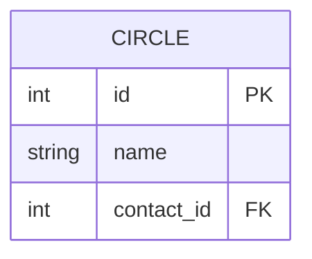
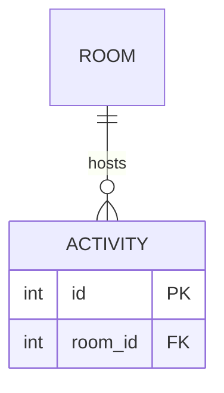
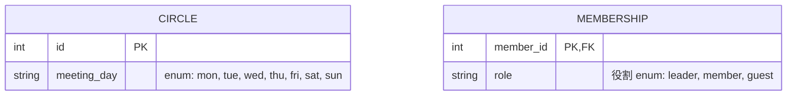

<div align="center">

[日本語](README.ja.md) | **English**

# ER Viewer

**Read split Mermaid ER diagrams across groups — without merging them.**

A read-only viewer: click a table that belongs to another group, and jump to the diagram that defines it.

[](https://mermaid.js.org/syntax/entityRelationshipDiagram.html)
[](https://www.typescriptlang.org/)
[](https://vite.dev/)
[](https://vitest.dev/)


<sub>The bundled example (a fictional community-center club): cross-group jump → candidate chooser → zoom → enum values</sub>

</div>

> The viewer UI is in Japanese. Button labels are quoted below as they appear, with a translation, e.g. 「拡大」 (zoom in).

## Features

- **Cross-group links** — Click a table that appears only on relationship lines to jump to the group that defines it; the table is centered and highlighted
- **Candidate chooser** — If several groups define the same table, you pick one. If no group defines it, it is not a link
- **Matched by identifier** — Tables are matched by the exact identifier written in the diagram (`ROOM`), not by a display label such as `ROOM["部屋"]`
- **Enum values** — Click a column whose attribute comment says `enum: mon, tue, …` to see its values in a popover
- **Zoom and pan** — Mouse wheel, the 「縮小」 / 「拡大」 / 「全体表示」 (zoom out / zoom in / fit) buttons, and drag
- **Read-only** — Diagrams are never modified. Point the viewer at a directory or a manifest with `ER_DIAGRAMS`
- **Static site** — `npm run build` writes `dist/`, which any static server can host

Search, filtering, export and editing are out of scope.

## Quick start

Requires Node.js 22 or later.

```bash
git clone https://github.com/ikisuke/er-tools.git
cd er-tools
npm install
npm run dev                                   # opens the bundled example at http://127.0.0.1:47321
```

To read your own diagrams, pass the directory that holds them:

```bash
ER_DIAGRAMS=/path/to/diagrams npm run dev
```

See [Writing ER diagrams so cross-group links work](#writing-er-diagrams-so-cross-group-links-work) for how to author them.

## How it behaves

- Pick one group from the diagram source; its ER diagram is rendered by Mermaid as written (columns and relationship labels are shown exactly as in the source)
- A table that has no attribute block in that diagram and appears only on relationship lines becomes a link
  - Exactly one group defines the identifier with an attribute block → jump to that diagram; the table is centered and highlighted
  - Several groups define it → the viewer shows the candidates and lets you choose
  - None → no link
- Matching uses the node identifier written in the diagram (`ROOM` for `ROOM["部屋"]`). Display labels and partial matches are never used. Matching is case-sensitive
- A column whose attribute comment contains `enum: value1, value2, …` gets a dotted underline; clicking it shows the values in a popover (see step 7 of the how-to)
- The diagram can be zoomed and panned (the diagram area only)
  - Mouse wheel: zoom around the cursor
  - 「縮小」 / 「拡大」 / 「全体表示」 (zoom out / zoom in / fit) buttons at the bottom right. Fit shows the whole diagram, up to 100%
  - Drag: pan the diagram (a drag that starts on a linked table pans; it does not follow the link)
  - Opening a group fits the whole diagram; following a link centers the target table at 100% or more
- The current group and table are kept in the URL (`#g=<group>&e=<table>`), so the browser's back/forward buttons work

## Choosing the diagram source

Set the `ER_DIAGRAMS` environment variable to a **directory** or a **manifest (JSON)**. If it is not set, `examples/diagrams` is used.

```bash
# Directory: each .mmd / .mermaid / .md / .markdown file directly inside is one group
ER_DIAGRAMS=/path/to/diagrams npm run dev

# Manifest: set group names and their order
ER_DIAGRAMS=/path/to/manifest.json npm run dev

# Build static files (serve dist/ with any static server)
ER_DIAGRAMS=/path/to/diagrams npm run build
npm run preview      # check at http://127.0.0.1:47322
```

- With a directory, the group name is the file name without its extension
- For `.md` / `.markdown`, the first ```` ```mermaid ```` block containing `erDiagram` is used as the diagram
- Files without `erDiagram` and files with duplicate group names are skipped, with a warning at the top of the screen

Manifest format (`file` is relative to the manifest):

```json
{
  "groups": [
    { "name": "サークル", "file": "diagrams/circles.mmd" },
    { "name": "会員", "file": "diagrams/members.mmd" }
  ]
}
```

## Writing ER diagrams so cross-group links work

The viewer assumes diagrams written the following way. It does not enforce this convention and does not judge whether a diagram is correct. If a diagram is written differently, links may be missing or unintended tables may become links.

### 1. One group = one file

- Write one ER diagram per group, one group per file
- Supported extensions: `.mmd` / `.mermaid` / `.md` / `.markdown`
  - `.mmd` / `.mermaid`: the whole file is read as a Mermaid diagram (files without `erDiagram` are skipped)
  - `.md` / `.markdown`: only the **first** ```` ```mermaid ```` (or `~~~mermaid`) block that contains `erDiagram` is read. You can write any prose around it, but one file cannot hold more than one group
- With a directory source, the group name is the file name without its extension (`circles.mmd` → `circles`). Only files directly inside the directory are read; subdirectories are ignored. Groups are listed in file-name order
- If two files have the same group name (e.g. `circles.mmd` and `circles.md`), the later one is skipped with a warning

### 2. Write your own group's tables with an attribute block (= definition)

Tables owned by a group are written with an attribute block `{ ... }` listing their columns. **Having an attribute block is what marks a table as "defined in this group".**



- A one-line `CIRCLE { int id PK }` and an empty `CIRCLE { }` also count as definitions
- A table's columns are written only in the diagram of the group that defines it

### 3. Write other groups' tables by identifier only, on relationship lines (= link)

Tables owned by other groups are written without an attribute block, by identifier only, on relationship lines. **A table that has no attribute block in the diagram and appears only on relationship lines** becomes a link to the group that defines it.



Here `ROOM` has no attribute block, so it becomes a link to the group that writes `ROOM` with an attribute block (e.g. `rooms`).

- Relationship lines use Mermaid `erDiagram` syntax. Both symbols (`||--o{`, `}o..|{`, etc.; solid `--` or dotted `..`) and the word form (`A one or more to zero or many B : label`) work
- A relationship line needs a label (after the `:`). This is required by Mermaid's syntax
- A table written with an attribute block in the same diagram is never a link, even if other groups define it too (it is "our own table" in that diagram)
- A table that never appears on a relationship line and is written on its own line by name only, like `LOCKER`, is neither a definition nor a link

### 4. Matching is an exact match on the node identifier

Definitions and links are matched by the **node identifier** exactly as written in the diagram. Write the same table with the same identifier on both the defining side and the referring side.

- Display labels are not used for matching. `ROOM["部屋"] { ... }` is displayed as 「部屋」, but its identifier is `ROOM`. Other groups link to it by writing `ROOM` (writing `"部屋"` does not create a link)
- Matching is case-sensitive: `room` and `ROOM` are different tables
- Partial matches and spelling variants (such as `ROOM` vs. `ROOMS`) are not treated as the same table
- Identifiers containing spaces are quoted, like `"ROOM KEY"`. The text inside the quotes (`ROOM KEY`) is used for matching

### 5. When several groups define a table, or none does

| Groups defining it with an attribute block | What the viewer does |
| --- | --- |
| One | It is a link; clicking it jumps to that group's diagram and centers and highlights the table |
| Several | It is a link; clicking it shows the list of candidate groups so you can choose (the viewer never picks one on its own) |
| None | No link (treated as something missing from the diagrams; the tool does not fill it in) |

Define the same identifier in several groups only when you mean to. To remove an unintended duplicate, drop the attribute block from one of the diagrams.

### 6. Relationship labels are shown verbatim

- Labels are shown exactly as written. They are not rewritten into constraint names or filled in
- Whether a relationship line corresponds to an SQL foreign-key constraint depends on the diagram. The tool does not decide. If you want to show a foreign-key name, put it in the label itself (e.g. `"reached via (fk_circle_contact)"`)

### 7. For enum columns, write the values in the attribute comment

If a column is an enum (it has a fixed set of values), write the values **in the attribute comment, after `enum:`**. The viewer only reads what is written in the diagram; it never infers values from outside the diagram, such as a database schema.



- The values go in the `"..."` at the end of the attribute line (Mermaid's attribute comment), after the type, column name and keys (`PK` / `FK` / `UK`) (e.g. `int kind FK "enum: a, b"`)
- Everything after `enum:` in the comment is the list of values. Any description can come before `enum:` (`役割`, "role", above)
- Separate values with `,` (ASCII comma) or `、`. Surrounding spaces are ignored and empty values are dropped
- `enum:` is case-insensitive and may have spaces before the `:` (`ENUM :` also works). The `:` must be ASCII
- The type can be anything (`string`, `enum`, `weekday`, …). A type of `enum` alone does not tell the viewer the values; always write them in the comment
- Mermaid comments cannot contain `"`, so values cannot contain `"`. Values cannot contain commas either
- In the diagram, the column name and comment of such a column get a dotted underline. Click the column (or focus the column name with the keyboard and press Enter) to see the values in a popover. Close it with Esc, the × button, or by clicking elsewhere in the diagram
- Mermaid still draws the comment itself in the diagram as usual; the viewer does not change how the diagram is drawn
- Write enum columns only in the diagram that defines the table (the one with the attribute block), since linked tables have no columns

### 8. Point the viewer at your diagrams

Pass the directory holding your diagrams, or a manifest that sets group names and order, in the `ER_DIAGRAMS` environment variable (see [Choosing the diagram source](#choosing-the-diagram-source)).

```bash
ER_DIAGRAMS=/path/to/diagrams npm run dev        # directory
ER_DIAGRAMS=/path/to/manifest.json npm run dev   # manifest
```

- With a manifest, `name` is used as the group name, and candidates are listed in manifest order
- The dev server re-reads the diagrams on every load, so after editing a diagram just reload the browser
- If Mermaid cannot render a diagram because of a syntax error, the error is shown on screen

### Checklist

- [ ] Every table owned by your group is written with an attribute block
- [ ] Tables owned by other groups have no attribute block
- [ ] Each other-group table's identifier matches the defining diagram's identifier exactly, including case
- [ ] The same identifier is defined in several groups only where intended
- [ ] For each table that is not a link (no dashed border), you confirmed that no group defines it
- [ ] Enum columns have `enum: value1, value2, …` in the attribute comment (and clicking shows the values)

Use the bundled examples (next section) as a reference. The `circles` diagram contains a unique link, an ambiguous link with a chooser, a table with no link, and an enum column.

## Bundled examples

`examples/diagrams/` contains three fictional groups about clubs that meet at a community center (`examples/manifest.json` lists the same diagrams with Japanese group names).

| Group | Contents |
| --- | --- |
| `circles` | Clubs and activity days. `ROOM` is unique, `CONTACT` needs a choice (defined in both `members` and `rooms`), `LOCKER` is not a link because no group defines it. `CIRCLE.meeting_day` is an enum column |
| `members` | Members, contacts and club memberships. `CIRCLE` links to `circles`. `MEMBERSHIP.role` is an enum column with a description |
| `rooms` | A Markdown file example: rooms, equipment and room-manager contacts. Matched by identifier even with a display label like `ROOM["部屋"]`. Defines `CONTACT`, which `members` also defines (the reason `circles` shows a chooser) |

- **Unique link**: `ROOM` in `circles` → only `rooms` defines it, so clicking it jumps to the `rooms` diagram
- **Candidate chooser**: `CONTACT` in `circles` → both `members` and `rooms` define it with an attribute block, so a dialog asks which one to open
- **No link**: `LOCKER` in `circles` → no group defines it, so it is shown as a plain table
- **Enum**: `CIRCLE.meeting_day` in `circles` (`"enum: mon, tue, wed, thu, fri, sat, sun"`) and `MEMBERSHIP.role` in `members` (`"役割 enum: leader, member, guest"`) → click the column to see its values

## Tech stack

- A static site built with **Vite + TypeScript** (no UI framework) and **mermaid**
- Diagrams are loaded by a Vite plugin (`plugin/diagram-source.ts`) and served as `diagrams.json`
  - The dev server re-reads them on every request, so regenerated diagrams show up after a browser reload
  - `npm run build` writes the diagrams as they are at build time to `dist/diagrams.json`
- Parsing and link resolution live in `src/parse.ts`, `src/links.ts` and `src/svg.ts`, zoom math in `src/zoom.ts`; all are unit-tested with Vitest

The UI is a single screen with little state, so it works with the DOM directly instead of using a framework.

## Development

```bash
npm test             # unit tests (Vitest)
npm run typecheck    # type check
```

The `docs/demo.gif` at the top is a recording of the bundled example running on the dev server and being used for real.
