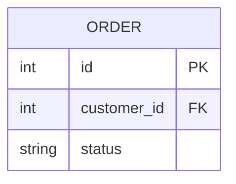
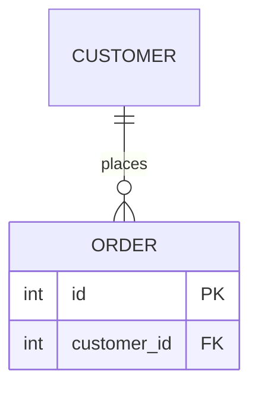

# ER ビューア

グループごとに分割された Mermaid の ER 図を、分割したまま横断して読むためのビューアです。図の中で「他のグループで定義された表」をリンクにし、押すとその表を定義しているグループの図へ移動します。図は読むだけで、書き換えません。

## できること

- 図の置き場所にあるグループから 1 つを選び、その ER 図を Mermaid でそのまま描画する（列・関係線のラベルは元の図のとおり）
- その図に属性ブロックが無く、関係線にだけ出てくる表をリンクにする
  - 同じ識別名を属性ブロック付きで定義しているグループが 1 つ → その図へ移動し、対象の表までスクロールして強調表示する
  - 複数ある → 候補を示して選ばせる
  - 無い → リンクにしない
- 照合は図に書かれたノードの識別名で行います（`PRODUCT["商品"]` の場合は `PRODUCT`）。表示名や部分一致では判断しません。大文字小文字も区別します
- 図は拡大縮小・移動できます（図の部分のみ）
  - マウスホイール: カーソル位置を中心に拡大縮小
  - 右下の「縮小」「拡大」「全体表示」ボタン（全体表示は図全体が収まる倍率。最大 100%）
  - ドラッグ: 図を移動（リンクの表の上から始めても移動になり、移動先へは飛びません）
  - グループを開いたときは全体表示、リンクで移動したときは対象の表を 100% 以上で中央に表示
- 表示中のグループと表は URL（`#g=<グループ>&e=<表>`）に入るので、ブラウザの戻る/進むが使えます

検索・絞り込み・書き出し・編集などは範囲外です。

## 技術構成

- **Vite + TypeScript**（UI フレームワークなし）と **mermaid** による静的サイト
- 図の読み込みは Vite プラグイン（`plugin/diagram-source.ts`）が行い、`diagrams.json` として配信します
  - 開発サーバーではリクエストのたびに読み直すため、図を作り直したらブラウザを再読み込みするだけで反映されます
  - `npm run build` では、その時点の図を `dist/diagrams.json` に書き出します
- 解析とリンク解決のロジックは `src/parse.ts`・`src/links.ts`・`src/svg.ts` にあり、Vitest で単体テストしています

UI が 1 画面で状態も少ないため、フレームワークを入れず DOM を直接扱う構成にしています。

## 使い方

Node.js 22 以降が必要です。

```bash
npm install
npm run dev          # http://127.0.0.1:47321 で同梱の例を表示
```

### 図の置き場所を指定する

環境変数 `ER_DIAGRAMS` に、**ディレクトリ** か **マニフェスト（JSON）** のパスを渡します。未指定なら `examples/diagrams` を読みます。

```bash
# ディレクトリ: 直下の .mmd / .mermaid / .md / .markdown を 1 ファイル = 1 グループとして読む
ER_DIAGRAMS=/path/to/diagrams npm run dev

# マニフェスト: グループ名と並び順を指定する
ER_DIAGRAMS=/path/to/manifest.json npm run dev

# 静的ファイルとして書き出す（dist/ を任意の静的サーバーで配信）
ER_DIAGRAMS=/path/to/diagrams npm run build
npm run preview      # http://127.0.0.1:47322 で確認
```

- ディレクトリ指定では、ファイル名（拡張子なし）がグループ名になります
- `.md` / `.markdown` では、`erDiagram` を含む最初の ```` ```mermaid ```` ブロックを図として読みます
- `erDiagram` が見つからないファイルや、グループ名の重複は読み飛ばし、画面上部に警告を出します

マニフェストの形式（`file` はマニフェストからの相対パス）:

```json
{
  "groups": [
    { "name": "顧客", "file": "diagrams/customers.mmd" },
    { "name": "注文", "file": "diagrams/orders.mmd" }
  ]
}
```

## ER 図の書き方（グループ間リンクを効かせるには）

このビューアは、次の書き方で作られた図を前提にしています。ツールはこの書き方を強制せず、図の内容の正しさも判断しません。書き方が違うと、リンクが付かないか、意図しない表がリンクになります。

### 1. 1 グループ = 1 ファイル

- 1 つのグループにつき 1 枚の ER 図を、1 ファイルに書きます
- 使える拡張子は `.mmd` / `.mermaid` / `.md` / `.markdown` です
  - `.mmd` / `.mermaid`: ファイル全体を Mermaid の図として読みます（`erDiagram` を含まないファイルは読み飛ばします）
  - `.md` / `.markdown`: ```` ```mermaid ````（または `~~~mermaid`）のブロックのうち、`erDiagram` を含む**最初の 1 つ**だけを図として読みます。説明文は自由に書けますが、1 ファイルに複数のグループを入れることはできません
- ディレクトリを指定した場合、グループ名はファイル名から拡張子を除いたものです（`orders.mmd` → `orders`）。読むのは直下のファイルだけで、サブディレクトリは見ません。一覧はファイル名順です
- グループ名が重複したファイル（例: `orders.mmd` と `orders.md`）は、後のほうを読み飛ばして警告を出します

### 2. 自分のグループの表は「属性ブロック付き」で書く（= 定義）

そのグループが持つ表は、列を並べた属性ブロック `{ ... }` 付きで書きます。**属性ブロックがあることが「この表はこのグループで定義されている」という印**になります。



- 1 行で書いた `ORDER { int id PK }` や、中身が空の `ORDER { }` も定義として扱います
- 同じ表の列は、その表を定義するグループの図にだけ書きます

### 3. 他のグループの表は「関係線の中に識別名だけ」書く（= リンク）

他のグループが持つ表は、属性ブロックを付けず、関係線の中に識別名だけを書きます。**その図に属性ブロックが無く、関係線にだけ出てくる表**が、定義しているグループへのリンクになります。



この図では `CUSTOMER` に属性ブロックが無いので、`CUSTOMER` を属性ブロック付きで書いているグループ（例: `customers`）へのリンクになります。

- 関係線の書き方は Mermaid の `erDiagram` と同じです。記号（`||--o{`、`}o..|{` など。実線 `--` と点線 `..` のどちらでも可）と、語による書き方（`A one or more to zero or many B : ラベル`）のどちらも使えます
- 関係線にはラベル（`:` の後ろ）が必要です。これは Mermaid の構文上の決まりです
- 同じ図の中で属性ブロック付きで書いた表は、他のグループにも定義があってもリンクになりません（その図では「自分の表」だからです）
- 関係線に出てこず、`WAREHOUSE` のように名前だけを 1 行で書いた表は、定義にもリンクにもなりません

### 4. 照合は「ノードの識別名」の完全一致

定義とリンクは、図に書かれた**ノードの識別名**をそのまま突き合わせます。定義する側と参照する側で、同じ表は同じ識別名で書いてください。

- 表示名は照合に使いません。`PRODUCT["商品"] { ... }` は画面には「商品」と表示されますが、識別名は `PRODUCT` です。他のグループからは `PRODUCT` と書けばリンクになります（`"商品"` と書いてもリンクになりません）
- 大文字小文字を区別します。`order` と `ORDER` は別の表です
- 部分一致や、前後の表記ゆれ（`ORDER` と `ORDERS` など）は同じ表とみなしません
- 空白などを含む識別名は `"ORDER ITEM"` のように引用符で囲みます。照合には引用符の中身（`ORDER ITEM`）を使います

### 5. 定義が複数・定義が無いとき

| 属性ブロック付きで定義しているグループ | ビューアの動き |
| --- | --- |
| 1 つ | リンクになり、押すとそのグループの図へ移動して、対象の表を中央に強調表示する |
| 複数 | リンクになり、押すと候補のグループ一覧を出して選んでもらう（どれかを勝手に選ばない） |
| 無い | リンクにしない（図の側の欠落として扱い、ツールは補わない） |

同じ識別名を複数のグループで定義するのは、意図してそうする場合だけにしてください。意図しない重複は、どちらかの図で属性ブロックを外すと解消します。

### 6. 関係線のラベルはそのまま表示される

- ラベルは図に書いた文字列のまま表示します。制約名などに読み替えたり、補ったりしません
- 関係線が SQL の外部キー制約に対応しているかどうかは、図によって異なります。ツールは判断しません。外部キー名を見せたい場合は、ラベル自体に書いてください（例: `"ships to (fk_order_address)"`）

### 7. ビューアに図の置き場所を渡す

書いた図を置いたディレクトリか、グループ名と並び順を指定したマニフェストを、環境変数 `ER_DIAGRAMS` で渡します（詳しくは上の「図の置き場所を指定する」）。

```bash
ER_DIAGRAMS=/path/to/diagrams npm run dev        # ディレクトリ
ER_DIAGRAMS=/path/to/manifest.json npm run dev   # マニフェスト
```

- マニフェストでは `name` がそのままグループ名になり、候補一覧もマニフェストに書いた順に並びます
- 開発サーバーは読み込みのたびに図を読み直すので、図を直したらブラウザを再読み込みするだけで確かめられます
- 構文の誤りで Mermaid が描画できない図は、画面にエラーの内容を表示します

### 書いたら確かめること

- [ ] 自分のグループの表は、すべて属性ブロック付きで書いた
- [ ] 他のグループの表には、属性ブロックを付けていない
- [ ] 他のグループの表の識別名が、定義している図の識別名と一字一句（大文字小文字も）同じ
- [ ] 同じ識別名を複数のグループで定義しているのは、意図したものだけ
- [ ] リンクにならない表（点線枠にならない表）は、どのグループにも定義が無いことを確認した

手本には同梱の例（次の節）を使ってください。`orders` の図に、一意に決まるリンク・候補選択になるリンク・リンクにならない表がそろっています。

## 同梱の例

`examples/diagrams/` に 4 グループあります（`examples/manifest.json` は同じ図を日本語のグループ名で並べたマニフェスト）。

| グループ | 内容 |
| --- | --- |
| `customers` | 顧客と住所。`ORDER` が `orders` へのリンク |
| `orders` | 注文と明細。`PRODUCT` は一意、`ADDRESS` は候補選択（`customers` と `shipping` の両方で定義）、`PAYMENT` はどこにも定義が無いためリンクなし |
| `catalog` | Markdown ファイルの例。`PRODUCT["商品"]` のように表示名を付けても識別名で照合 |
| `shipping` | 倉庫・在庫・出荷。`ADDRESS` を `customers` と重複して定義している（`orders` の候補選択の元） |

- **一意に決まる例**: `orders` の `PRODUCT` → `catalog` だけが定義しているので、押すと `catalog` の図へ移動します
- **候補選択の例**: `orders` の `ADDRESS` → `customers` と `shipping` の両方が属性ブロック付きで定義しているので、どちらへ移動するか選ぶダイアログが出ます
- **リンクにならない例**: `orders` の `PAYMENT` → どのグループにも定義が無いので、普通の表として表示されます

## 開発

```bash
npm test             # 単体テスト（Vitest）
npm run typecheck    # 型チェック
```
