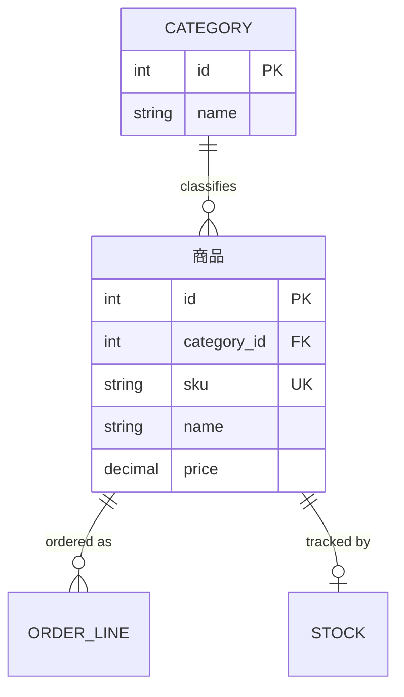

# 商品カタログ

Markdown ファイルでも、最初の `erDiagram` を含む mermaid ブロックが図として読まれます。

```mermaid
erDiagram
    PRODUCT["商品"] {
        int id PK
        int category_id FK
        string sku UK
        string name
        decimal price
    }
    CATEGORY {
        int id PK
        string name
    }
    CATEGORY ||--o{ PRODUCT : "classifies"
    PRODUCT ||--o{ ORDER_LINE : "ordered as"
    PRODUCT ||--o| STOCK : "tracked by"
```
