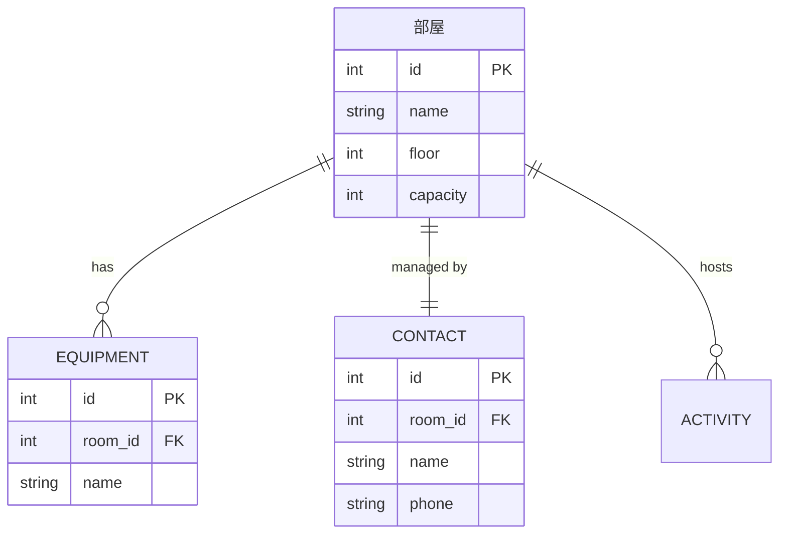

# 部屋

Markdown ファイルでも、最初の `erDiagram` を含む mermaid ブロックが図として読まれます。
`ROOM["部屋"]` のように表示名を付けても、他のグループからは識別名の `ROOM` で参照します。

```mermaid
erDiagram
    ROOM["部屋"] {
        int id PK
        string name
        int floor
        int capacity
    }
    EQUIPMENT {
        int id PK
        int room_id FK
        string name
    }
    CONTACT {
        int id PK
        int room_id FK
        string name
        string phone
    }
    ROOM ||--o{ EQUIPMENT : "has"
    ROOM ||--|| CONTACT : "managed by"
    ROOM ||--o{ ACTIVITY : "hosts"
```
